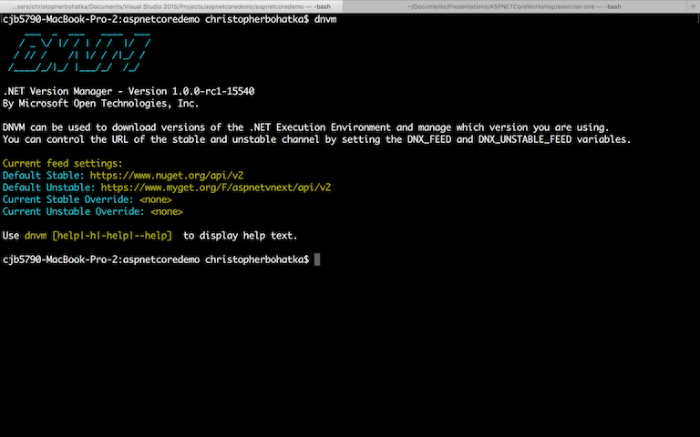
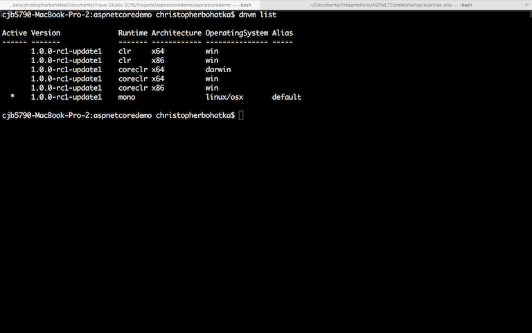

# Verify Installation

First, open a Command/Terminal window and run the following command:

```
dnvm
```

If you see this...



...then everything is installed correctly.

If you didn't see the wonderful DNVM ASCII art, please go to [https://get.asp.net](https://get.asp.net) to download and install ASP.NET Core 1.0.

Next, run the following command to determine what runtimes are available to you:

```
dnvm list
```

You should receive a list similar to the following (this is platform dependent):



Now, let's set our active runtime. On Windows, this will likely be the `x64 clr` version. On Mac/Linux, this will be the `mono` version.

```
dnvm use 1.0.0-rc1-update1
```

If you need to specify the Runtime or Architecture, you will use the `-r` and `-arch` flags respectively.

```
dnvm use 1.0.0-rc1-update1 -r clr -arch x64
```