# Retrieve Artists and Render in View via TagHelper

In the last exercise we wrote our ArtistRepository to retrieve Art records from the database. Now, let's use that repository in the Web layer and display a list of the Artists in the browser.

Until now we've been using our HomeController for everything. Let's create a new ArtistController and Index View.

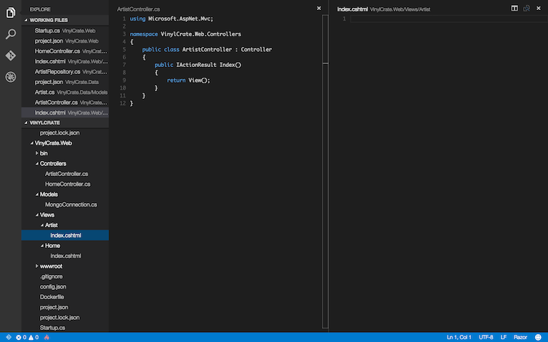

## Quick Sidebar:

One thing I want to mention within the "new" MVC is attribute routing. After using attribute routing with Web API, I have grown accustomed to this syntax, and now that the Controller class has been merged between MVC and Web API, this syntax can be used in MVC.

You can add a Route attribute to the controller to specify the "root" of the route for all actions inside if your controllers. If you want this to be the controller name you can use the following syntax in your attribute:

```csharp
[Route("[controller]")]
```

This also allows for easy overriding of the default MVC routing. For example, you may have a need for the "home page" of your site to be something other than the default MVC route of Home/Index/id. You could just move all of whatever logic that is inside of your HomeController, but if you value naming, this can become a maintenance nightmare. So, if you want the "home page" to be a different controller, you can set your controller route to be empty, such as:

```csharp
[Route("")]
```

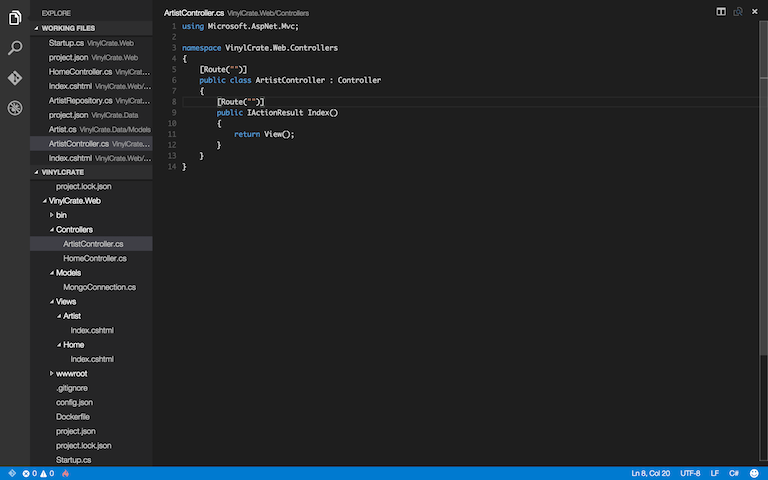

This is something I have started doing in my controllers, that way when working inside of a controller, I can quickly construct and debug routes without deciphering a RouteConfig file located elsewhere.

## End Sidebar

With our new Controller and View, we need to use our `ArtistRepository` to get our list our artists.

Inside of `ArtistController`, let's set up our repository call.

We will be using the `OptionsModel` to inject our `MongoConnection` class to pass the connection string into the `ArtistRepository`.

Setup the constructor:

```csharp
public ArtistController(IOptions<MongoConnection> mongoConnection)
{
	
}
```

We should now create a private field for our ArtistRepository that we will instantiate in the constructor.

```csharp
private readonly ArtistRepository _artistRepository;
```

Then in the constructor, we can instantiate this using our `MongoConnection` values.

```csharp
public ArtistController(IOptions<MongoConnection> mongoConnection)
{
	_artistRepository = new ArtistRepository(mongoConnection.Value.ServerAndPort, mongoConnection.Value.DatabaseName);
}
```

Notice the need for calling to retrieve the `Value` property on the IOptions object. It may be beneficial to create a new local variable that retains the reference to the deserialized `MongoConnection`.

```csharp
public ArtistController(IOptions<MongoConnection> databaseConnection)
{
	var mongoConnection = databaseConnection.Value;
	_artistRepository = new ArtistRepository(mongoConnection.ServerAndPort, mongoConnection.DatabaseName);
}
```

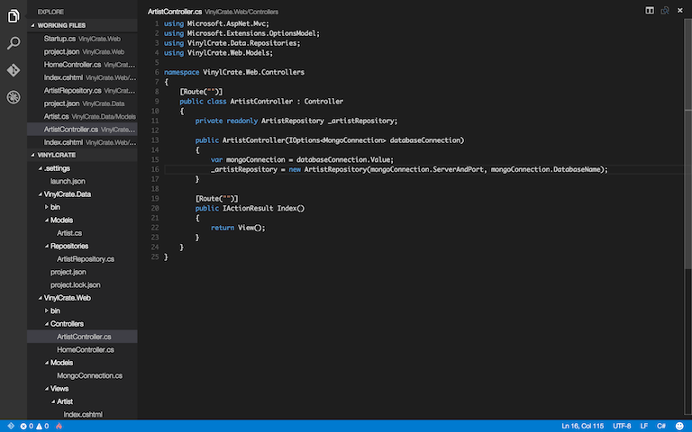

Go ahead and build. Did you remember your using statements?

```
using Microsoft.Extensions.OptionsModel;
using VinylCrate.Data.Repositories;
using VinylCrate.Web.Models;
```

Our repository is now instantiated in our Controller and we can use it to retrieve our records. For now, let's assume our model for the Index view is just a `List<Artist>`. We can pass the `GetAll()` function directly into our View.

```csharp
[Route("")]
public IActionResult Index()
{
	return View(_artistRepository.GetAll());
}
```

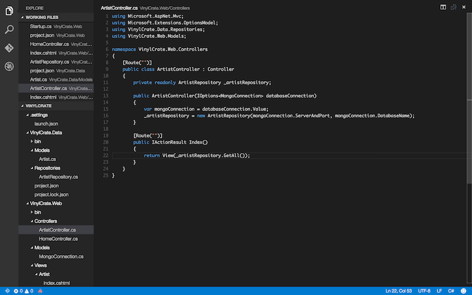

Inside ouf our view, declare the model:

```html
@model List<VinylCrate.Data.Models.Artist>
```

And let's create a list of our artists. We will need to loop over them and output an `<li>` tag for each of them.

```html
<ul>
@foreach (var artist in Model)
{
	<li>@artist.Name</li>
}
</ul>
```

Building and running should result in a simple list of our artists.

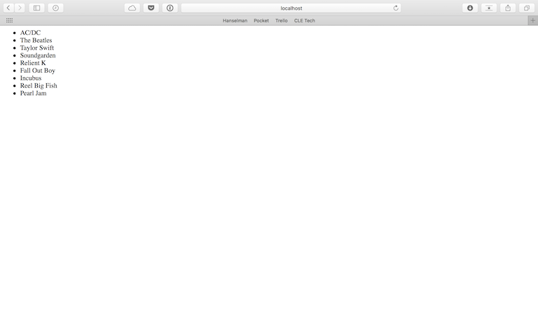

If the requirement from the business was to create this list of artists, we could consider our task complete.

I don't know about you, though, but I'm not crazy about the syntax of the `foreach` loop in the view.

Let's create a quick TagHelper to improve the markup in our view, and one that we can reuse anytime we need a simple list.

By convention, create a "TagHelpers" folder in the root of the project.

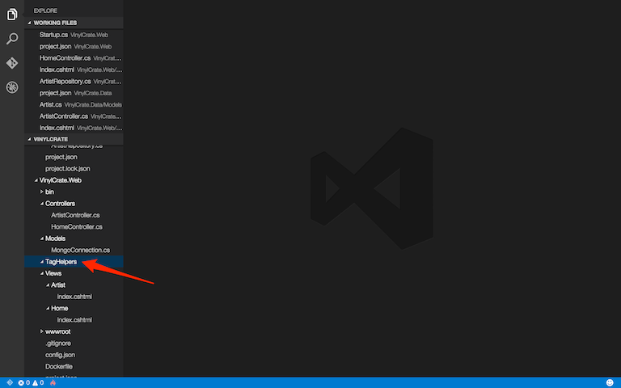

Create the class, which will be our TagHelper, `ArtistListTagHelper.cs`.

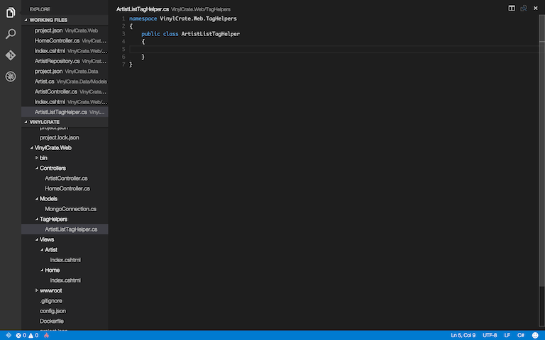

A TagHelper is defined as any class which inherits from `ITagHelper`. A TagHelper has a single `Process()` function, and only accepts input and returns an output. They have been engineered for simplicity; improving upon the model of their predecessor, HTML Helpers.

Add the inheritance on the `TagHelper` interface:

```csharp
public class ArtistListTagHelper : TagHelper
```

Which requires a reference to:

```csharp
using Microsoft.AspNet.Razor.TagHelpers;
```

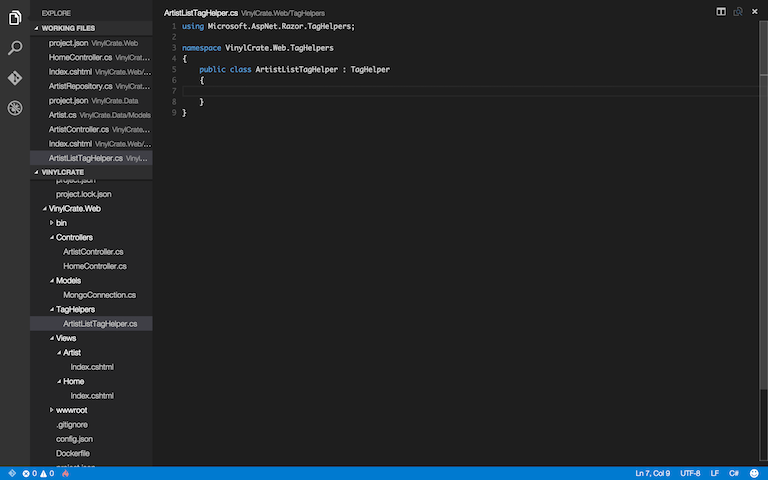

Add the `Process()` function to the class.

```csharp
public override void Process(TagHelperContext context, TagHelperOutput output)
{
	
}
```

The first thing we should add here is what the output TagName will be. In this case, it will be a `<ul>`.

```csharp
output.TagName = "ul";
```

This specifies that wherever we use our TagHelper, it will be replaced with a `<ul>` tag on render.

We want our TagHelper to accept a List from our Model and output a simple unordered list. Any public property we add to the TagHelper will be avaialble as an attribute in the markup.

Create a property to accept our collection.

```csharp
public List<Artist> Collection { get; set; }
```

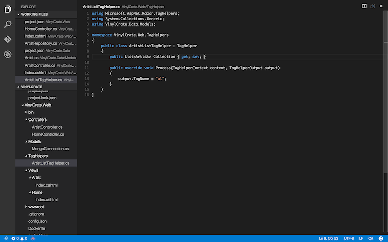

Just like any of other project, build periodically as you develop.

```
dnu build
```

Did you remember your usings?

```
using System.Collections.Generic;
using VinylCrate.Data.Models;
```

We have defined our output tag, and created our Collection property. We not need to create the content for our tag. Our content for the `ul` will be several `<li>` tags containing our Artists names.

Create a content variable and loop through each artist, appending the `<li>` to the content.

After we have completed this, we can set the output Content, which will automatically return on execution.

```csharp
public override void Process(TagHelperContext context, TagHelperOutput output)
{
	output.TagName = "ul";
	
	string content;
	
	foreach (var artist in Collection)
	{
		content += $"<li>{artist.Name}</li>";
	}
	
	output.Content.SetHtmlContent(content);
}
```

Note, that since our content is HTML, we are actually using the `SetHtmlContent` function to set our output content.

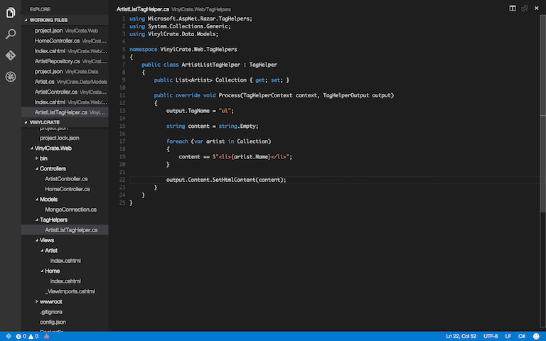

Our TagHelper is now complete. In order to use it, though, we need to register it with the framework.

A new convention is available for this in MVC 6. In the root level of the "Views" folder, create a View called `_ViewImports.cshml`.

This will essentially be the entry point for the rendering engine, similar to `Startup.cs` for the server-side. Here we can declare global imports for our views.

In order to use our newly created TagHelper, add the following lines:

```html
@using VinylCrate.Web
@addTagHelper "*, VinylCrate.Web"
```

This import is using wildcard syntax to add all TagHelpers in our project to the global scope.

Now, let's replace the `foreach` loop in our view with our TagHelper.

Inside of `Artist/Index.cshtml`, remove the existing loop code and add the following:

```html
<artist-list collection="@Model"></artist-list>
```


Now, if we build and run, we should see a list identical to before, but now with improved markup in the view.

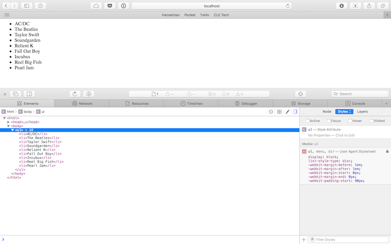