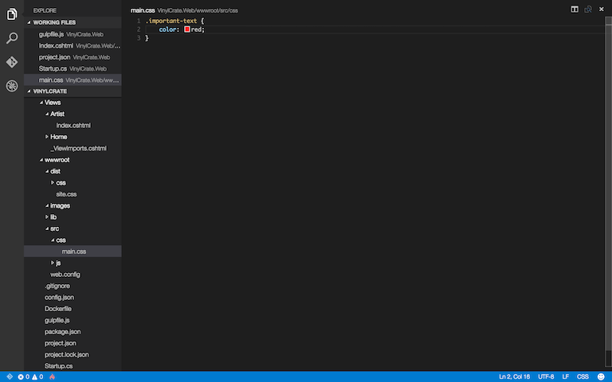

# Adding Styling to ArtistListTagHelper

Now that we have our ArtistListTagHelper, and we've explored for to add front end assets to our site, let's imagine a scenario where we would like to modify the styling of the unordered list rendered by the `ArtistListTagHelper`.

For this exercise, let's create a `main.css` class in the `src` folder containing the following class:

```css
.important-text {
	color: red;
}
```



Let's add this `main.css` file into our site bundle.

```js
gulp.task('bundle:site', function () {
	var files = [
		'./' + webroot + '/lib/bootstrap/dist/css/bootstrap.css',
		'./' + webroot + '/src/css/main.css'
	];
	
	bundle(files, 'site', 'css');
});
```


Make sure to run `gulp` now that we've modified our bundle. 

Now, let's add a property to our `ArtistListTagHelper` to accept any CSS classes and apply them to the list.

```csharp
public string CssClass { get; set; }
```

Inside of the `Process()` function, we can now add this value to the "class" attribute of the outout tag.

```csharp
output.Attributes["class"] = CssClass;
```


On the view, add the `css-class` property and then test in the browser.


The style is now applied to the list element.