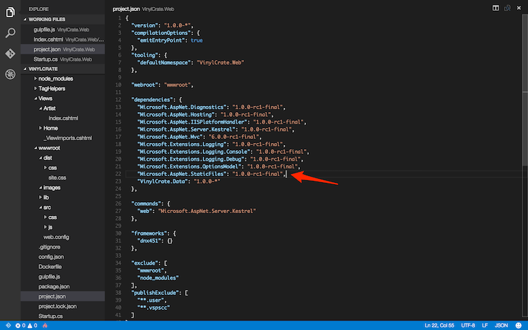

# Managing Front End Assets with npm and Gulp

In the past, all package management (front-end and back-end) has been done through NuGet. Unfortunately, primarily or front-end packagaces, Nuget isn't always as current as other package management ecosystems, like npm. You also cannot control where NuGet "installs" scripts and styles to.

In ASP.NET Core and the accompanying tools, better support for npm, gulp, grunt, bower, etc has been added and is the recommended approach for package managemet.

In this exercise, we will pull in [Bootstrap](http://getbootstrap.com) to assist with some styling. We will do so using [npm](https://www.npmjs.com) and [Gulp](http://gulpjs.com).

First thing we need to do is configure our project for work with npm. From the Command/Terminal window, navigate to the root of your `VinylCrate.Web` project and run:

```
npm init
```

And follow the on-screen prompts.

This will create a `package.json` file for you. This stores information about your project and the dependencies it has.


Now, if you look at the root of the `VinylCrate.Web` project, you will see your `package.json` file.


As mentioned before, this file will keep track of the project npm dependencies. This way, when a colleague is working through the same code base, they can perform a base `npm install` and all necessary packages will be restored.

Let's pull in bootstrap. To do this, the syntax will be...

```
npm install [PACKAGE NAME] --save
```

The `--save` argument is what will write the dependency to the `package.json` file.

Go ahead and install bootstrap:

```
npm install bootstrap --save
```


If we look at the contents of our `package.json` now, we will see a dependencies section with bootstrap recorded.


And in our project directory, we now see a `node_modules` folder. This is where all npm packages will download to. 

**IMPORTANT**: Do **NOT** commit this folder to source control. Many npm packages have many dependencies and this folder can grow quite large at times. All packages will be resoted by running `npm install`. Please add this to your ignore lists.

ASP.NET Core serves all static content out of the `wwwroot` folder. We will be using Gulp to copy the files we need out of `node_modules` and into our `wwwroot` directories.

Gulp is a task runner/build tool for front end assets. It can perform a large variety of tasks, such as minification and bundling. The typical flow is as follows:

* Copy files from `node_modules`
* Create bundles
* Minify
* Create sourcemaps

Let's get started with Gulp. Install it via npm:

```
npm install gulp --save
```

In the root of the `VinylCrate.Web` project, create your gulpfile. This is the file that gulp looks for by convention when running gulp tasks from the Command/Terminal window.


The gulpfile is nothing more than just a javascript file.

In here we will add our tasks. Our first task will be to move all necessary files out of the `node_modules` folder. But where are we moving them to?

I have adopted a convention with the folowing folders inside of `wwwroot`:

* dist - the files we will deliver to the browser in a production environment
* lib - third party dependencies, usually via npm
* src - first party assets

At the same level there would also be an `images` folder and any other asset folders necessary.

Within each of those folders would be a folder for "css" and another for "js".


In our gulpfile, we first need to add a dependency on gulp using `require` syntax. 

```js
var gulp = require('gulp');
```

Next, let's declare a couple variables for re-use throughout our gulpfile.

First, the webroot. If for any reason the webroot changes, we wan t o have this configurable in a single location.

```js
var webroot = 'wwwroot';
```

Next, let's define a couple path variables to reduce duplication throughout our gulp file. We will be using the paths for npm and the lib folder multiple times.

```js
var paths = {
	npm: './node_modules/',
	lib: './' + webroot + '/lib/'
};
```

Now we can write our first task, which will be "copy:lib".

Let's take a look at the fully writeen task and break it down.

```js
gulp.task('copy:lib', function () {
    var npmPackages = {
		bootstrap: 'bootstrap/dist/**/*.{css,js}'
	},
        fileList = [];

    for (var packageIdentifier in npmPackages) {
        fileList.push(paths.npm + npmPackages[packageIdentifier]);
    }

    return gulp.src(fileList, {
		base: paths.npm
	})
        .pipe(gulp.dest(paths.lib + '.'));
});
```

The first argument of the `task()` function is the task name. The second is an anonymous function containing the logic that will be called when running this task.

Inside of our `copy:lib` task, we are first defining the list of specific files we want to move from our `node_modules` folder.

We then loop through each of these and oush the full paths into an array.

That array is then passed to a built-in gulp function, `src()` which defines the source files for the next operation we are piping into. The next operation is `dest()`, which takes a folder location and performs a copy operation.

Now, if we define our "default" gulp task, we can have this task run as part of our gulp "package" that will become part of our build process.

```js
gulp.task('default', ['copy:lib'])
```

Again, the first argument is the task name, but in the second argument we are using an overload which accepts an array of other task names.

Head to your Command/Terminal window and run `gulp`. In the output, you will see that the `copy:lib` task was run.


if you look at your `lib` folder, you should now see the bootstrap files.


With our lib folder in place, let's create our first bundle. 

The lib folder is strictly a place to reference files from when bundling. I recommend not using the lib folder to reference directly on the page (in a Production environment). The purpose of the lib folder is more or less separation of concerns. If our package manager of choice changes from npm to anything else in the future, we only need to update our `copy:lib` task and not every bundle task. 

I also recommend creating a function for bundling that will be reused through your gulp bundle tasks.

Here is an example:

```js
function bundle(fileList, bundleName, bundleExtension) {
    return gulp.src(fileList)
        .pipe(sourcemaps.init())
        .pipe(concat(bundleName + '.' + bundleExtension))
        .pipe(gulpif(bundleExtension == 'css', cssmin()))
        .pipe(gulpif(bundleExtension == 'js', jsmin()))
        .pipe(rename({ suffix: '.min' }))
        .pipe(sourcemaps.write('.'))
        .pipe(gulp.dest(paths.dist + '/' + bundleExtension));
}
```
For the purposes of our exercise, this will be our bundle task:

```js
function bundle(fileList, bundleName, bundleExtension) {
    return gulp.src(fileList)
        .pipe(concat(bundleName + '.' + bundleExtension))
		.pipe(gulp.dest(paths.dist + '/' + bundleExtension + '/.'));
}
```

In order for this to compile, we need to add the `gulp-concat` package via npm...

```
npm install gulp-concat --save
```

...and add a require to our `gulpfile`:

```js
var gulp = require('gulp'),
	concat = require('gulp-concat');
```

We can now define a new gulp task for our bundle of site css (which currently only includes bootstrap):

```js
gulp.task('bundle:site', ['copy:lib'], function () {
	var files = [
		'./' + webroot + '/lib/bootstrap/dist/css/bootstrap.css'
	];
	
	bundle(files, 'site', 'css');
});
```

The second argument in this bundle defines a dependency this task has on another. This bundle task will call `copy:lib` before it runs. This way we can ensure that our files will be there in `lib` before we try to bundle them.

The body of this task is fairly straightforward. We define our list of files we want to bundle, then call our bundle function.

I typically create a "bundle" task which calls all of my specific bundle tasks.

```js
gulp.task('bundle', ['bundle:site']);
```

Now in our "default" bundle, we have a single reference to the "bundle" task:

```js
gulp.task('default', ['bundle']);
```


Our site css bundle is now in our `dist` folder, and we can reference it in our view.

On `Artist/Index.cshtml` add a link to this stylesheet.

```html
<link rel="stylesheet" href="~/dist/css/site.css" />
```

**NOTE:** For those on Mac running with Mono, there is a known bug in Mono that prevents view from rendering after configuring npm. Please run the following command as a workaround:

```
export MONO_MANAGED_WATCHER=false
```

At this point, we should be able to render our view and see our stylesheet loading via the deveoper tools. But it currently returns a 404.


This is due to the fact that, by default, ASP.NET Core will not serve static files. This is a configuration that needs to take place in the `Startup.cs`. We need to add a dependency on "Microsoft.AspNet.StaticFiles" and perform a restore.

```
"Microsoft.AspNet.StaticFiles": "1.0.0-rc1-final"
```

```
dnu restore
```



Then in the `Startup.cs`, we will tell the app to `UseStaticFiles()` BEFORE the `app.useMvc()` call.

```
app.UseStaticFiles();
```


Now, running in the browser, our site.css should load succesfully.

```
dnx web
```


As a semi-quick note, Microsoft has a library of TagHelpers we can add a reference to. In this library, there is an `<environment>` TagHelper, which allows you to specify conditional asset rendering in your view based on the current environment. For example, in Development, you won't want to load minified files for quicker debugging, but you do in Production for performance. Here is an example:

```html
<environment names="Development">
	<link rel="stylesheet" href="~/lib/bootstrap/dist/css/bootstrap.css" />
	<link rel="stylesheet" href="~/css/site.css" />
</environment>
<environment names="Staging,Production">
	<link rel="stylesheet" href="//ajax.aspnetcdn.com/ajax/bootstrap/3.3.5/css/bootstrap.min.css"
			asp-fallback-href="~/lib/bootstrap/dist/css/bootstrap.min.css"
			asp-fallback-test-class="sr-only" asp-fallback-test-property="position" asp-fallback-test-value="absolute" />
	<link rel="stylesheet" href="~/css/site.min.css" asp-append-version="true" />
</environment>
```


