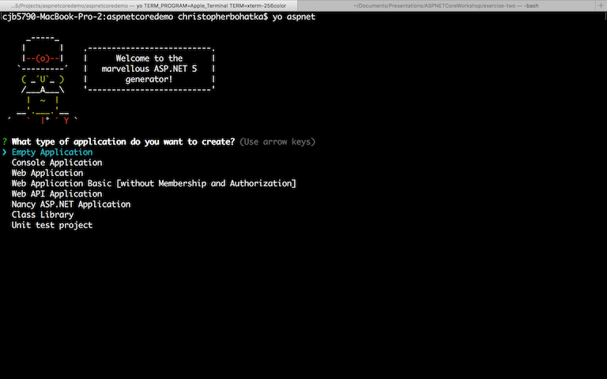
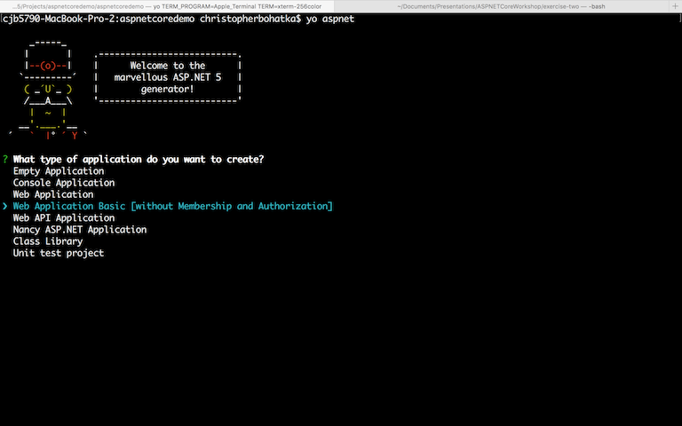
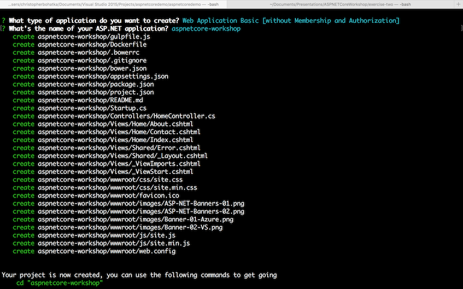
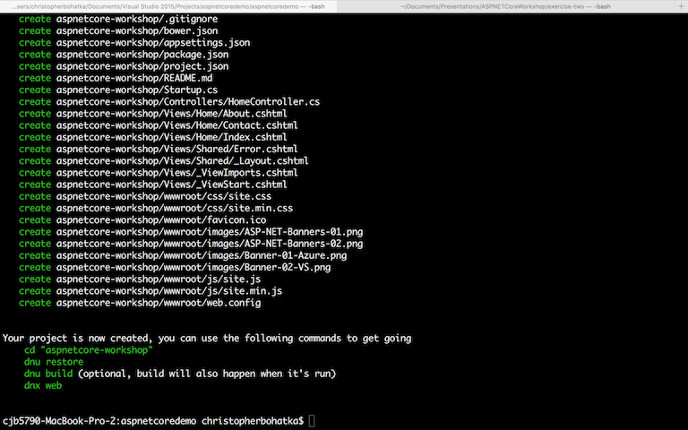
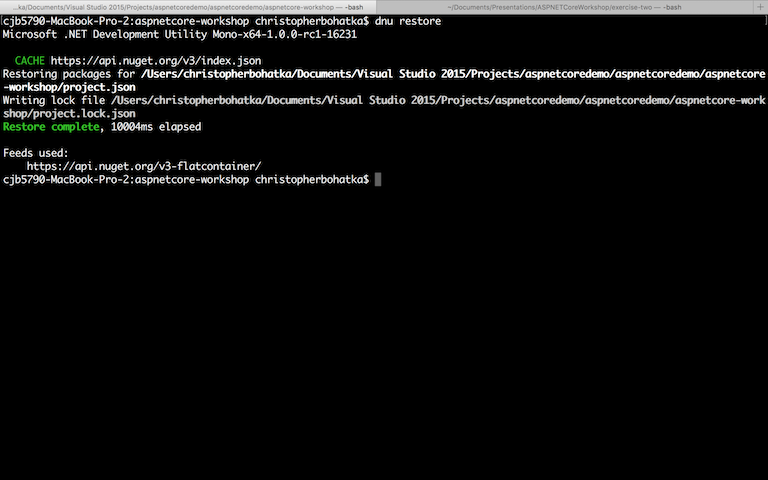
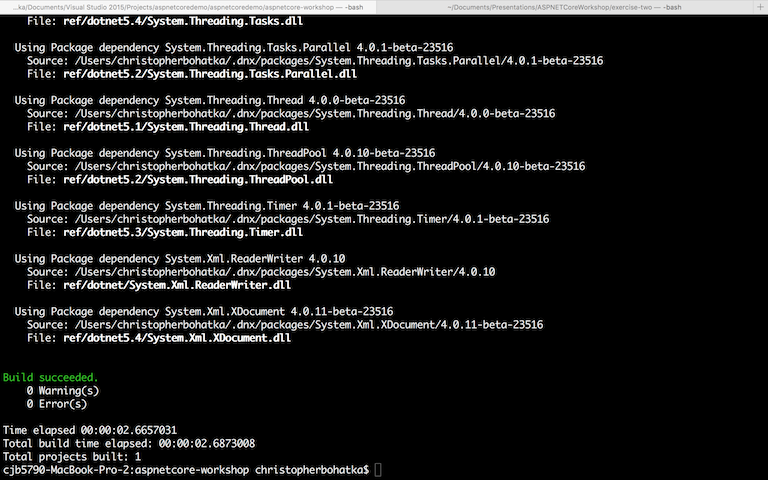
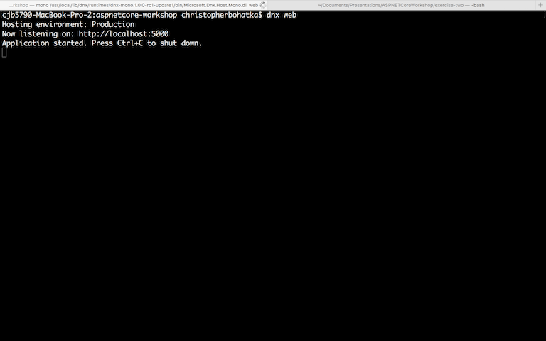
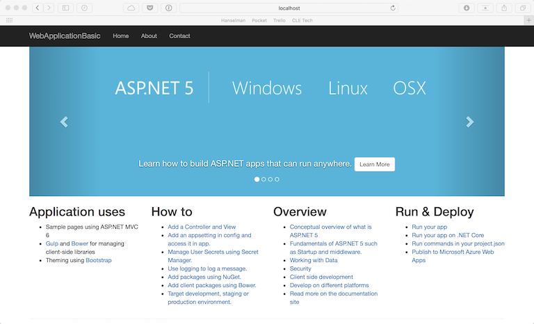

# Scaffold an ASP.NET Core Application



Let's use [Yeoman](http://yeoman.io) to scaffold our application:

```
yo aspnet
```

Running the command above will start Yeoman and prompt us to select an application type, similar to the New Project dialog in Visual Studio.

For this example, we will be selecting "Web Application Basic" in order to examine the structure of an ASP.NET Core application.



After selecting "Web Application Basic", you will be prompted to enter an application name.

Once you have done this, Yeoman will proceed to scaffold our application.



You will now see that Yeoman is instructing us to run some additional commands in order to "get going" with ASP.NET Core.



Take Yeoman's advice and run these commands.

```
cd [YOUR PROJECT NAME]
```

The next command will restore all dependencies the application has via NuGet. 

```
dnu restore
```



This command replaces `nuget restore` from previous .NET versions.

Next, we will build the application. This replaces `msbuild` from previous .NET versions.

```
dnu build
```



Here's where things start to deviate from the norm a little.

The next command references `dnx` which is the DotNet Execution Enviromnment.

This command will start the kestrel webserver and host our application for us.

This replaces IIS Express from previous .NET versions.

```
dnx web
```



NOTE: You can still run ASP.NET Core applications in IIS Express (the Visual Studio default) and IIS proper.

