# Create "Vinyl Crate" app and Configure MVC

Using `yeoman` we will create a new `Empty Application` to begin constructing our Web layer.

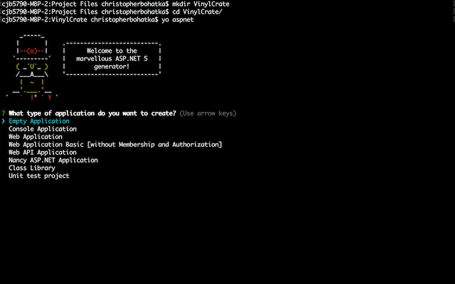

The above screenshot shows the creation of our root project directory, `VinylCrate`. You can do this from the command line, or from the Explorer/Finder window.

Once this is complete, we will run `yo aspnet` similar to Exercise #2; only this time, we will be selecting `Empty Application`.

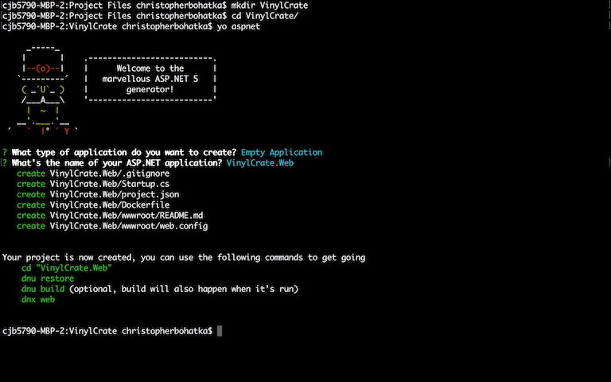

The name of our application will be `VinylCrate.Web`. Yeoman will create our project directory for us. Notice how the list of created files for the `Empty Application` is significantly smaller than the `Basic Web Application` in Exercise #2 and the "Empty Project" from ASP.NET 4.

Let's run the commands that Yeoman is instructing us to:

```
cd VinylCrate.Web/
dnu restore
dnu build
dnx web
```

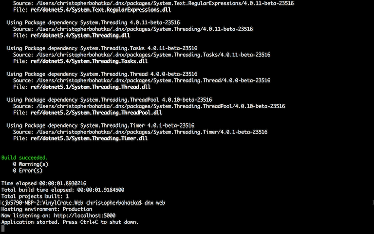

Our application is now running at `http://localhost:5000`, so let's navigate there:

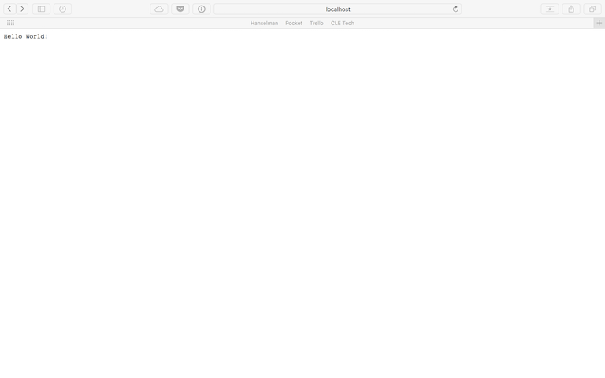

You should see "Hello World!" printed in the browser.

Let's examine how this is happening.

Let's open our application in Visual Studio Code. You can do this by either:

a) Opening Visual Studio Code, selecting File -> Open then navigating to your project directory

-or-

b) Navigating to your root project folder in Explorer/Finder, right-click and select "Open With -> Visual Studio Code"

This is what your project should look like once it is open in Visual Studio Code.

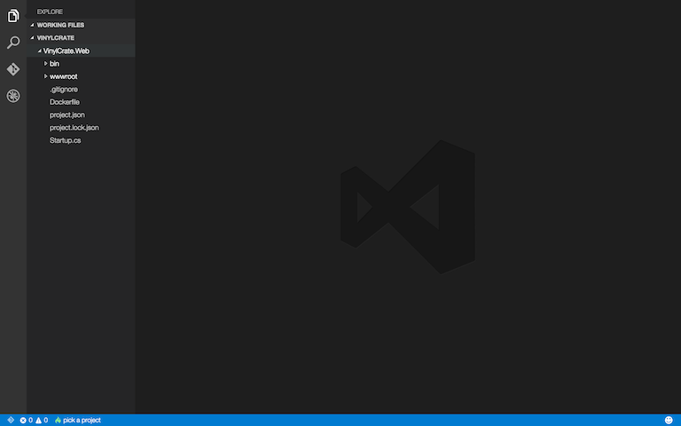

NOTE: Towards the bottom left it has a flame icon and says "pick a project". Click on this and select `project.json VinylCrate.Web`. This will define the primary project and enable features like Intellisense.

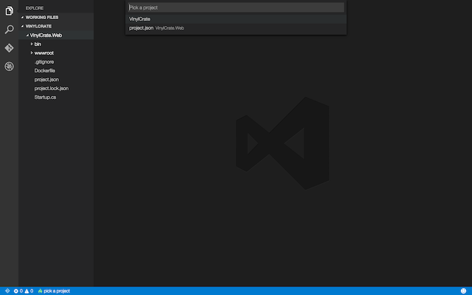

Now, open up the `Startup.cs` class.

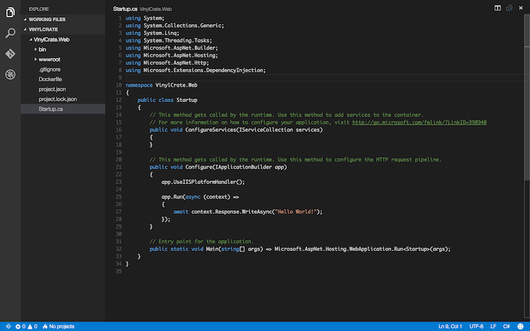

This class is the entry point to our application. Notice the Main method on line 32 similar to a console application?

The `ConfigureServices` method is where we will define & configure all of the services we are using, as well as perform dependency injection.
The `Configure` method is where we will give our application some instructions on how to run, as well as environmental configurations.

Currently, in our `Configure` method, we are calling `app.Run()` which simply does a `Response.Write()` to print out "Hello World!"

If we look at our `project.json` file and view our dependencies, we will see that MVC is not currently part of our project. 

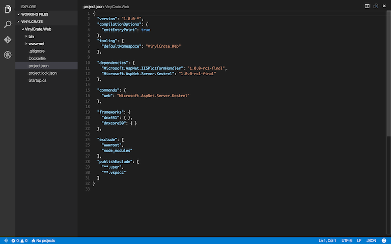

By default, ASP.NET MVC is a package addition.

So let's add it...

On a new line nested inside of "dependencies", add the following:

```
"Microsoft.AspNet.Mvc": "6.0.0-rc1-final"
```

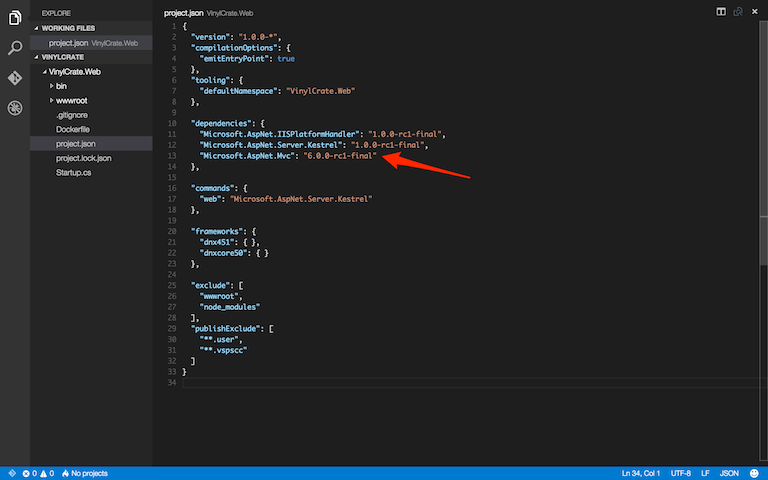

After adding new packages, it is encouraged to re-run `dnu restore`.

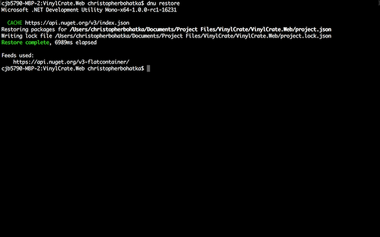

Now, navigating back to our Startup.cs, we can configure and use MVC...

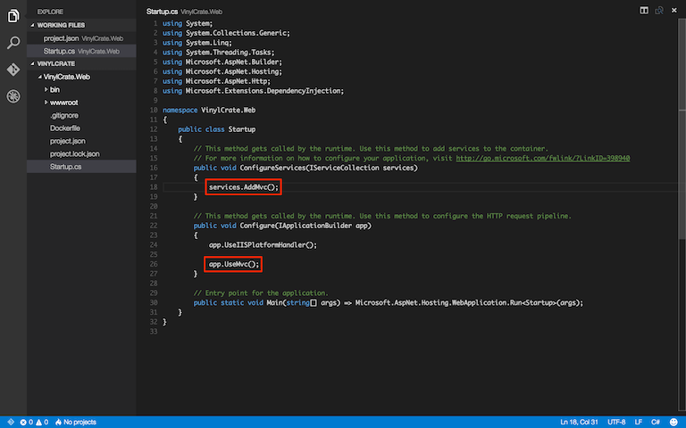

Given that we've made code changes (and remembered to save them!), we must re-build using `dnu build`.
After successfully building, we can re-run our application; this time, using ASP.NET MVC.

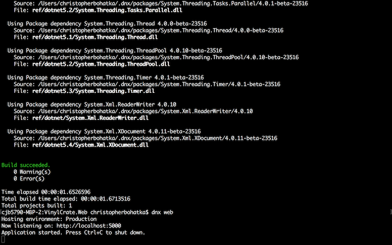

But, we forgot to add any views! Now that we are running MVC, the framework needs to know what to render. Let's go back into our app and create a home page.

Inside of Visual Studio Code, create a "Views" folder and a "Controllers" folder. You can right-click and select "New Folder" or if you hover the root project name, a New Folder icon will appear.

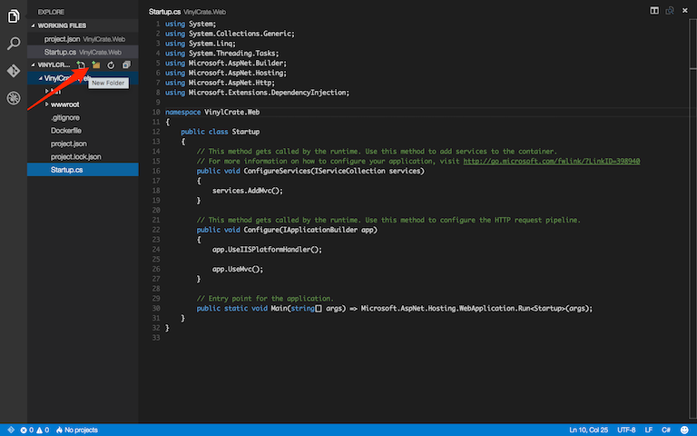

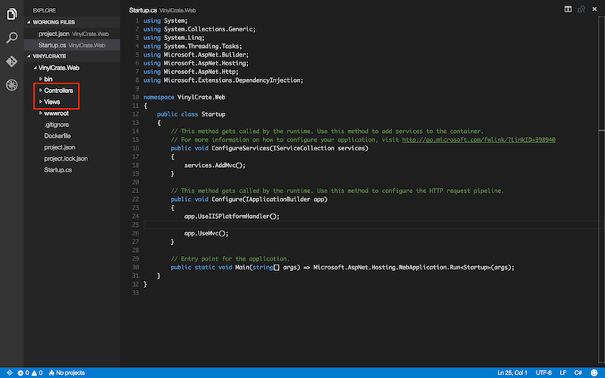

Inside of "Views", create a folder named "Home":

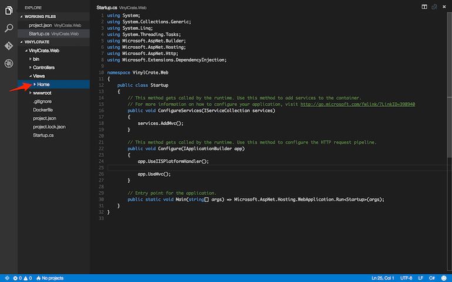

Inside of "Controllers", create a `HomeController.cs`:

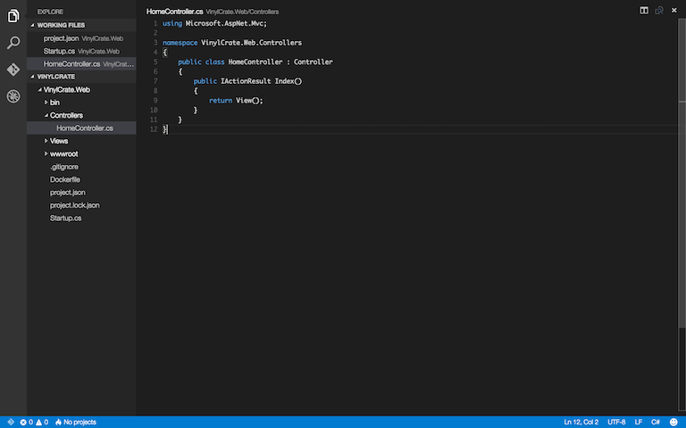

Our `HomeController.cs` will consist of the same contents we see in MVC today.

One notable difference is that the return type is now an Interface (`IActionResult`).

Now that we have our controller configured with an Index View method, let's create our `Index.cshtml` inside of `~/Views/Home/`.

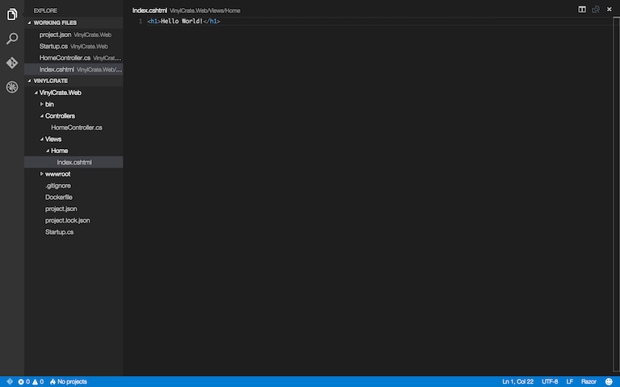

For now, let's have our application display "Hello World!" in a Heading 1 tag.

Find your way back to your Command/Terminal window, re-build the application, and re-run it.

```
dnu build
```
then
```
dnx web
```

If you navigate to your newly built site at `http://localhost:5000`, you will only see a blank screen.

This is due to the routing in MVC. When we configured our application and service in `Startup.cs`, we did not define the default routing for MVC.

Let's backtrack and add this:

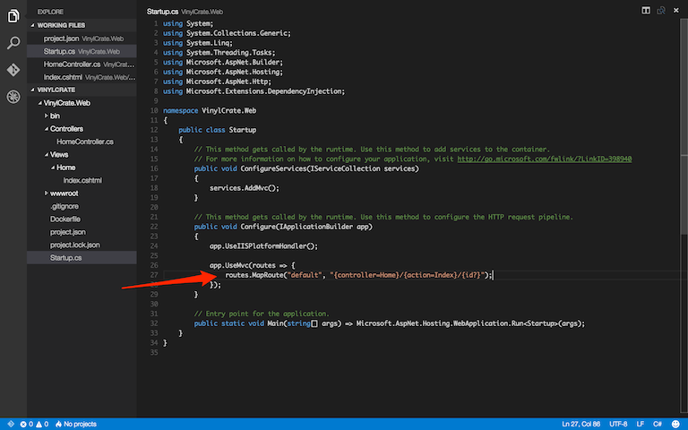

Now, run your application and navigate to it in browser. You should see the Heading reading "Hello World!"

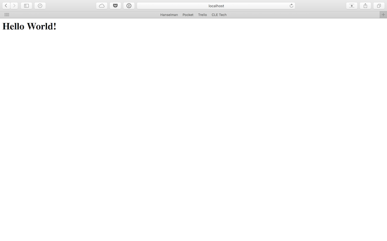