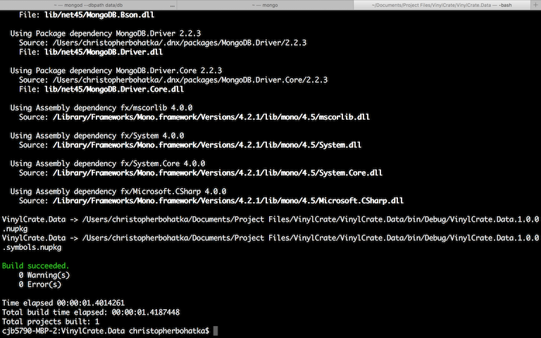

# Create a NuGet Package From a Class Library in ASP.NET Core

Our `VinylCrate.Data` project is a class library. This made it easy to add a reference to it in the `VinylCrate.Web` project. We are also able to easily create a NuGet package from class libraries in ASP.NET Core.

For this exercise, let's pretend we wanted to share `VinylCrate.Data` with the world via NuGet for whatever reason. In order to upload your package to NuGet, you need to create a `nupkg` file.

With ASP.NET Core, this is very straightforward. In the Command/Terminal window, run `dnu pack` and the `nupkg` file will be created for you, referencing values in your `project.json` for naming and versioning.

