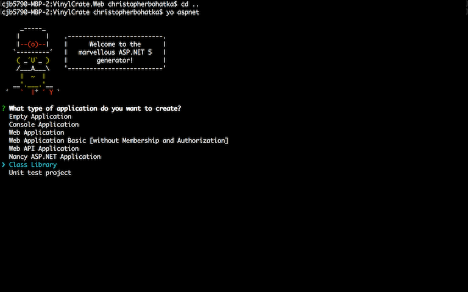
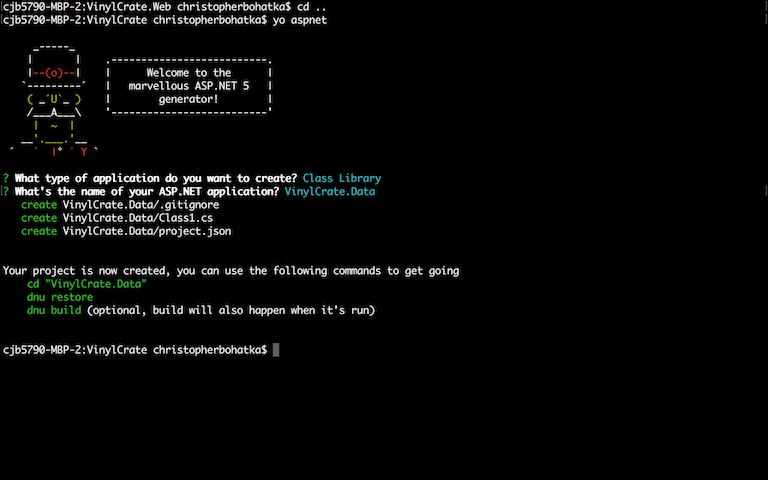
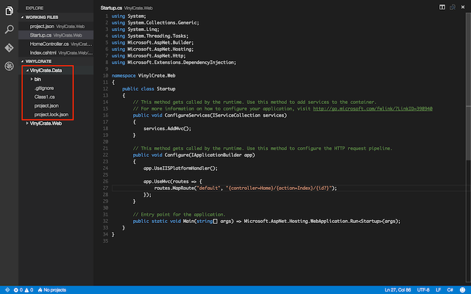
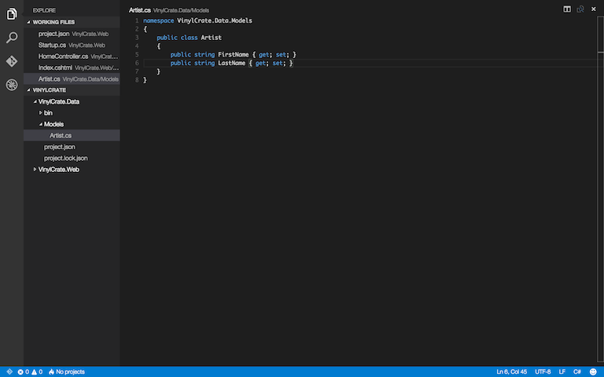
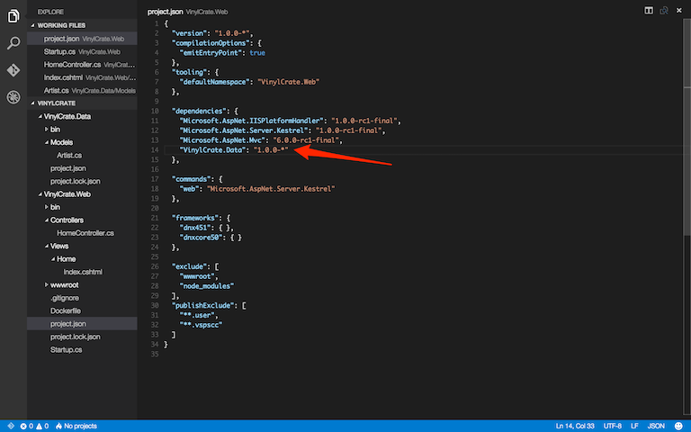
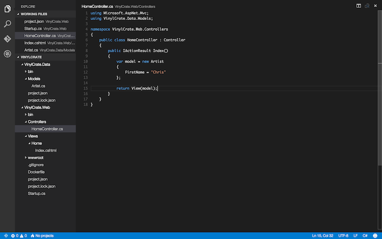
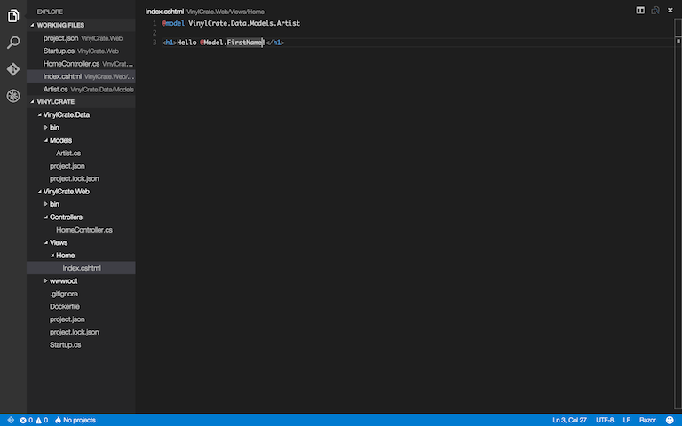
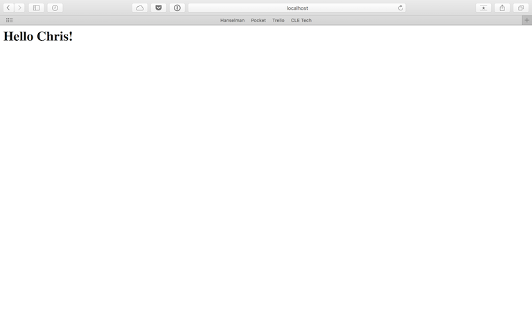

# Create "VinylCrate.Data" and add project reference to "VinylCrate.Web"

In this exercise we will be creating our Data layer, and adding a reference to it inside of our Web layer. This is a basic N-Tier architecure; you can read more on that [here](https://msdn.microsoft.com/en-us/library/bb384398.aspx) later.

In your Command/Terminal window, change directory, or `cd` to the root level of your project. Then, we will run `yo aspnet` again, but this time selecting `Class Library`.



Our Application Name will be "VinylCrate.Data".



Flipping back over to Visual Studio Code, we should see our Data project as part of the "solution explorer":



Inside of `VinylCrate.Data`, let's create a "Models" folder and create our first model.

Create the Models folder, then create an Artist class, containing FirstName and LastName properties. You can also remove the `Class`.cs` file, as this was an auto-generated class stub from Yeoman (same with the .gitignore file).



Let's use this model inside of VinylCrate.Web to have our home page print our "Hello [YOUR FIRST NAME]!" instead of "Hello World!"

But first, run `dnu build` on `VinylCrate.Data`.

To add a reference between the projects, open the `project.json` in `VinylCrate.Web` file and add a line under `dependencies` similar to how we added MVC earlier. If you look at the `project.json` inside of the VinylCrate.Data project, you will see that the version number is `1.0.0-*`.



We will now need to run a restore on our Web project in order to pull in the new dependency on `VinylCrate.Data`.

Now that we've added our reference, head to your HomeController. Here we will be creating a new Artist and passing our model to the view.

```csharp
var model = new Artist
{
	FirstName = "[YOUR FIRST NAME]"
};
```



With the model begin passed into the view, we need to go set up our view to handle this.

On the first line in the view (`Index.cshtml`), specify the model type:

```csharp
@model VinylCrate.Data.Models.Artist
```

Then, replace "World" with the model property `FirstName`.



At this point, we should be able to perform a build and run to test our application. 

```
dnu build
dnx web
```

