# Adding Error Pages to VinylCrate.Web

In Exercise #3 we set up our view to accept a model and print out a value. At this point, we could add "ASP.NET Core" to our LinkedIn profiles; we're getting good. But what if we weren't? We're working exclusively in Visual Studio Code, with (at times) limited Intellisense and auto complete. Visual Studio proper handles a lot for us that we may take for granted. What if we had forgotten to add the `namespace` to our Artist class? Or if we had forgotten to declare our model in our view before using it? Let's explore that...

It's time to break things. Fun, right?

In our view, let's comment out our model declaration:

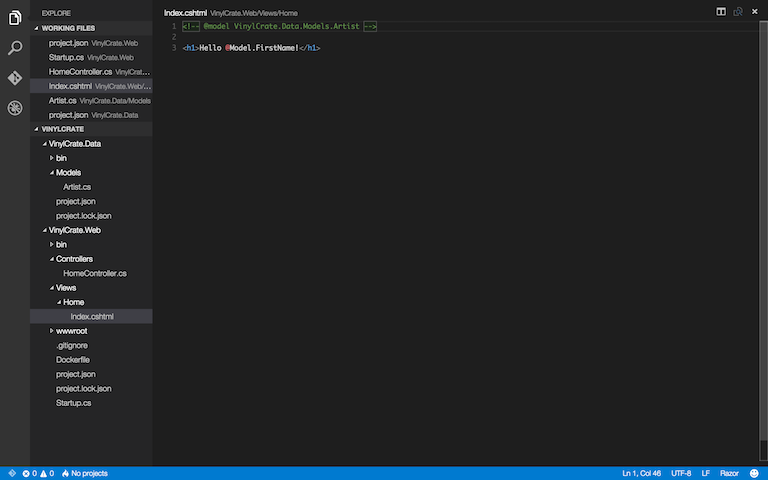

Now, if we run our application, we are presented with no error and a blank white screen:

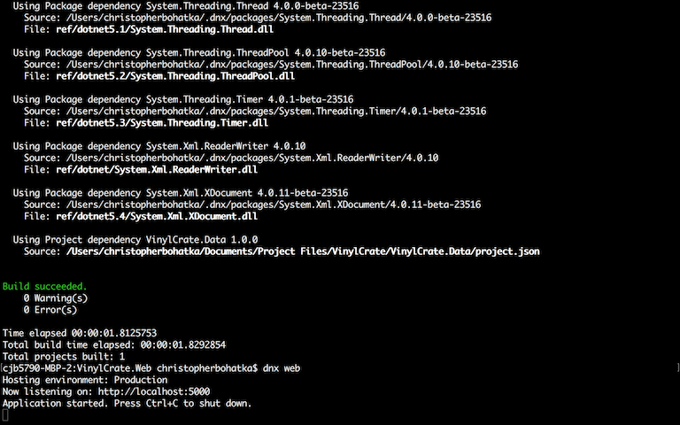

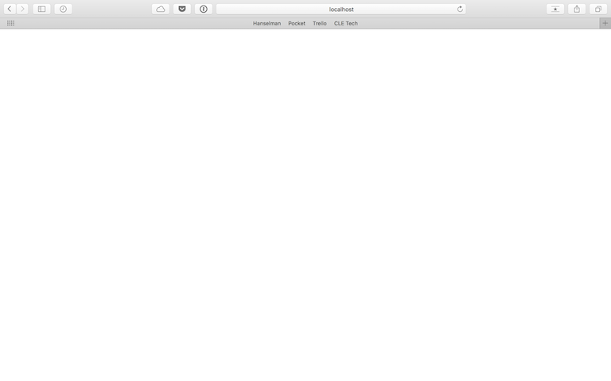

Normally, in this scenario, we would see the "yellow screen of death" from ASP.NET. In ASP.NET Core, everything is modular and the developer error pages must be added.

We will first need to add a dependency on "Microsoft.AspNet.Diagnostics", specifically version "1.0.0-rc1-final":

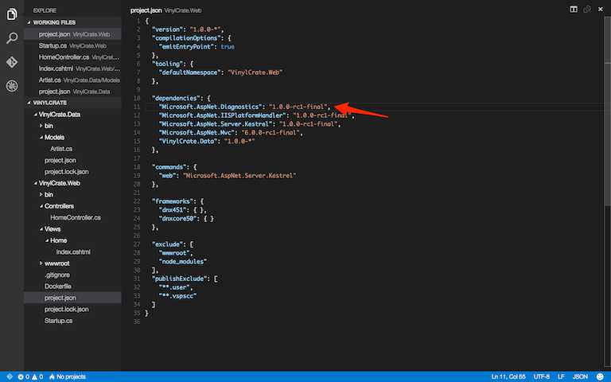

After adding this dependency, run `dnu restore`.

Next, as we learned earlier, we need to configure our services and application in `Startup.cs`. 

Under `Configure()`, set:

```csharp
app.UseDeveloperExceptionPages();
```

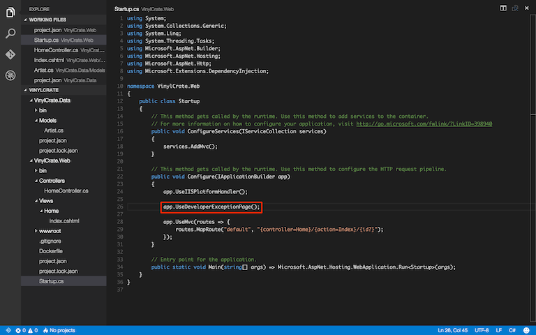

Now, let's test it.

```
dnu build
dnx web
```

After running the above commands, navigate to your browser and refresh. You should see an error page similar to the following:

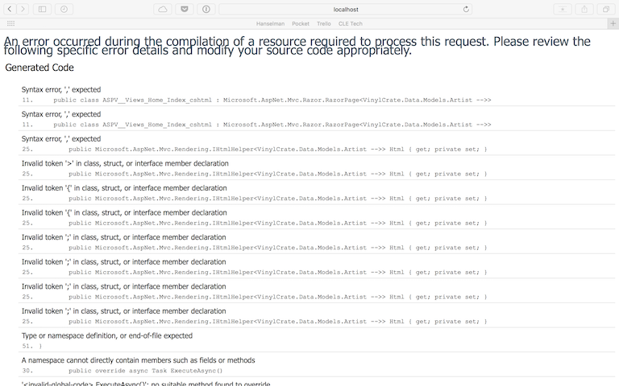

If you scroll down past the Generated Code errors, you will see our error:

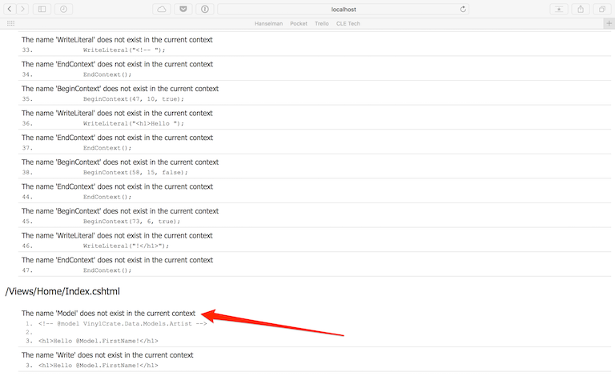

The above error screen captures are of the error page on Mac running on top of Mono. The error pages on Windows will look different.

Referring back to our `Startup.cs`, having configured our application to use these developer error pages, they will occur at all times. In previous versions of ASP.NET, removing the debug tag from the web.config would cease the rendering of these pages.

In ASP.NET Core, there is a concept of a `HostingEnvironment` which can control certain features and settings. We can use this HostingEnvironment on Startup to determine when to use developer exception pages.

Open `project.json` and add a dependency for "Microsoft.AspNet.Hosting":

```
"Microsoft.AspNet.Hosting": "1.0.0-rc1-final",
```

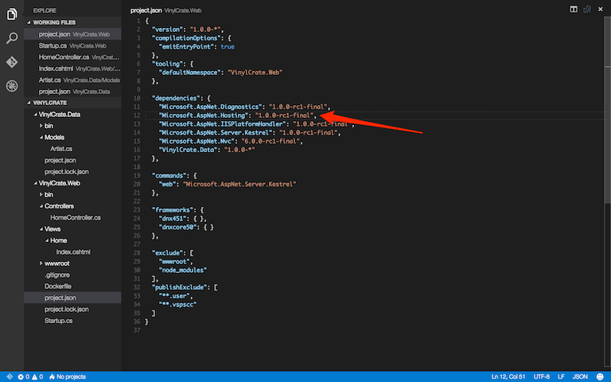
 
Open `Startup.cs`. Add a parameter to `Configure` for the HostingEnvironment:

```csharp
public void Configure(IApplicationBuilder app, IHostingEnvironment env)
```

Within the `Configure()` method, we will now add a conditional to determine what our environment is.

```csharp
if (env.IsDevelopment())
{
	app.UseDeveloperExceptionPage();
}
```

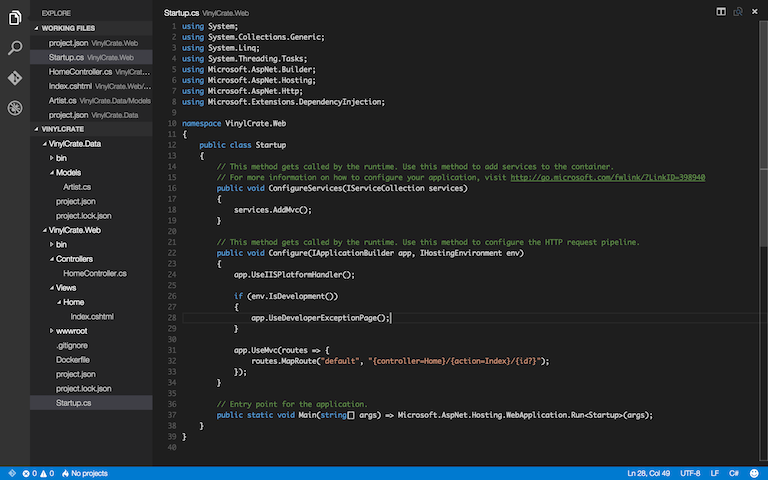

The `IsDevelopment()` function is built-in and will look for the environment variable to be "Development".

Restore and Build to verify the changes.

```
dnu restore
dnu build
```

If you pay attention when running `dnx web` you will see that, by default, the environment is set to Production.

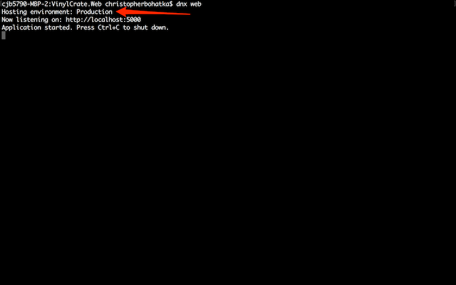

Reloading our application will result in a blank screen again. In order to run in the "Development" environment, we must pass an argument to the `dnx web` command.

```
dnx web --ASPNET_ENV=Development
```

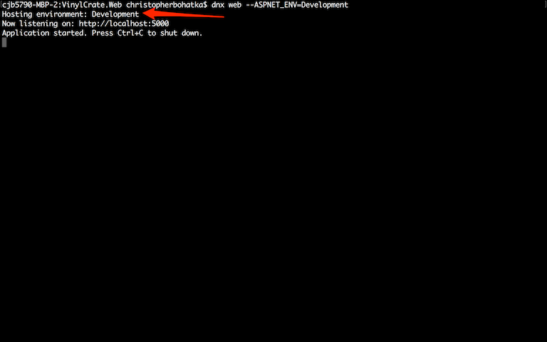

We are now running with the environment set to "Development" and will continue receiving our developer error pages.

**Before continuing, uncomment the model declaration in `Index.cshtml`.**