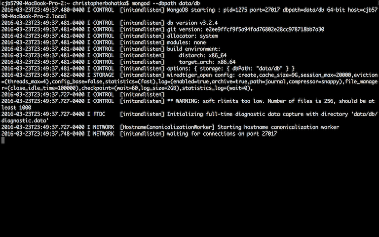
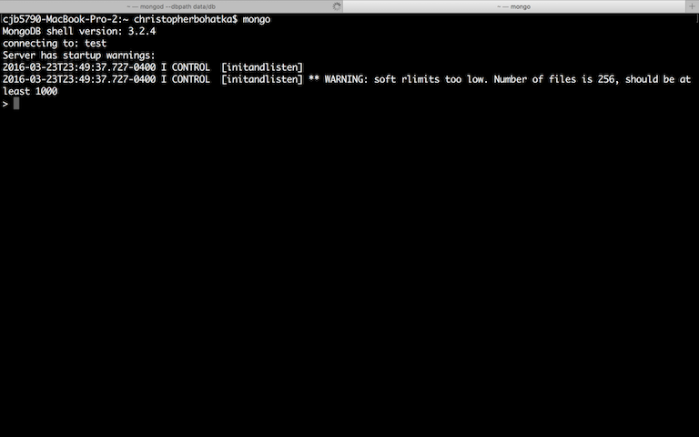
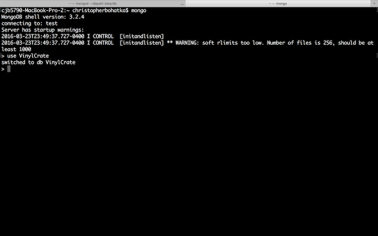
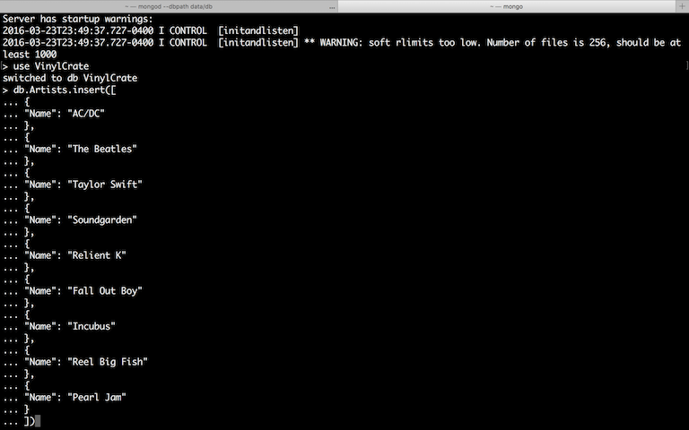
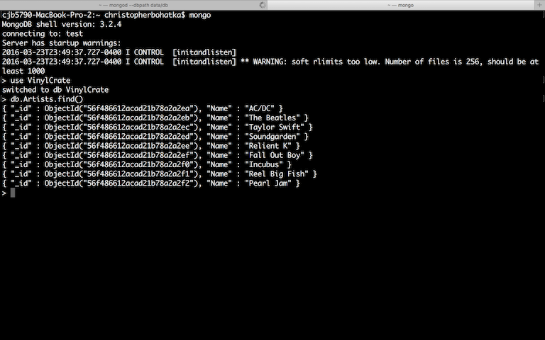

# Setting up MongoDB and Configuring VinylCrate.Web for Database Connection

Before we continue developing our VinylCrate application, let's take some time to set up a database.

For this exercise, we will be using MongoDB. For installation, please go to the [MongoDB Downloads page](https://www.mongodb.org/downloads#production). You may also reference the following [docs page](https://docs.mongodb.org/master/installation/) to assist in the process.

After performing the installation, we will need to create a data directory for Mongo to reference. Wherever preferable (I recommend at the root system or user level), create a folder called `data` with a child folder named `db`. This will be our path for the actual database files.

```
mkdir -p data/db
```

Once we have this directory created, we can start our MongoDB service. When starting the service, we will need to pass in an argument containing the path to the `data/db` folder we just created.

```
mongod --dbpath data/db
```

NOTE: The above dbpath is Mac specific. On Windows, this may look something like:

```
mongod --dbpath=C:\data\db
```



With the MongoDB service running, we can now use the MongoDB Client to interact with the database.

In a new Command/Terminal tab or window, run the following command to open the MongoDB Client:

```
mongo
```



We are now running inside of the MongoDB Client and can perform database commands.

When first starting the shell, we connect to the "test" database. We should create a new database specifically for VinylCrate.

By running:

```
use VinylCrate
```

Mongo will check for an existing database titled "VinylCrate" and if it is not found, it will create one.



The concept of tables within MongoDB is replaced with Collections, in which Documents are stored.

Similar to how a new database is created if attempting to switch to it and it doesn't exist, new Collections will be created if running commands against it before they are created.

With this in mind, let's insert our first record into the Albums collection, which will create our Albums collection.

```
db.Artists.insert([
	{
		"Name": "AC/DC"
	},
	{
		"Name": "The Beatles"
	},
	{
		"Name": "Taylor Swift"
	},
	{
		"Name": "Soundgarden"
	},
	{
		"Name": "Relient K"
	},
	{
		"Name": "Fall Out Boy"
	},
	{
		"Name": "Incubus"
	},
	{
		"Name": "Reel Big Fish"
	},
	{
		"Name": "Pearl Jam"
	}
])
```



To verify our insertion, let's perform a find for the whole collection:

```
db.Artists.find()
```



We can now configure our data layer to talk to this database and retrieve these records.