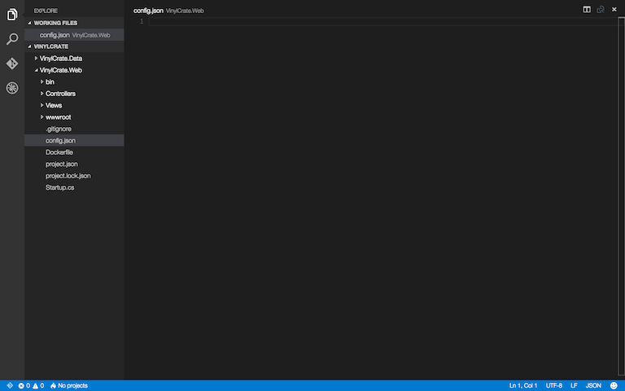
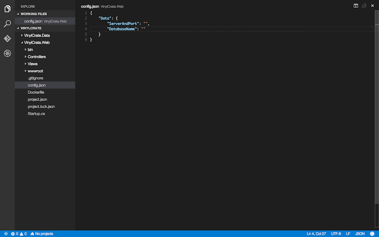
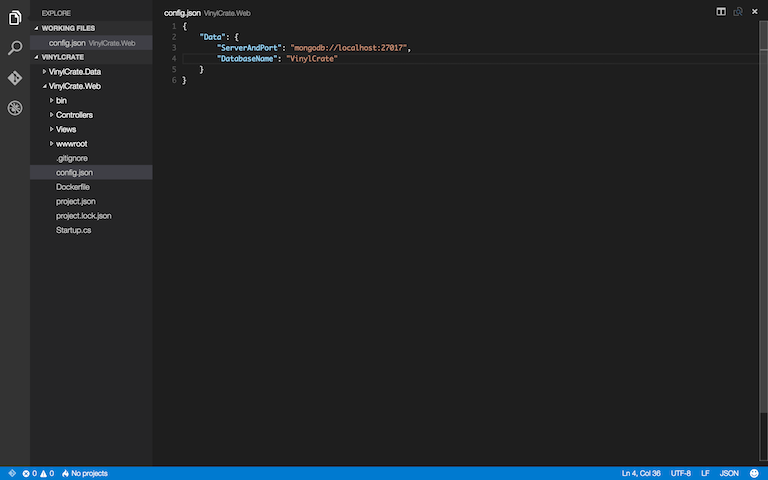
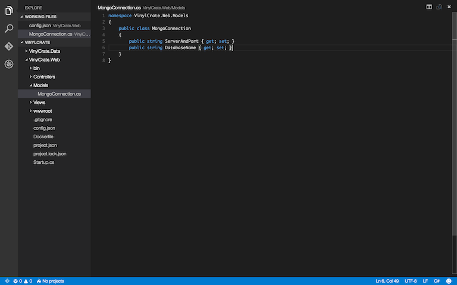
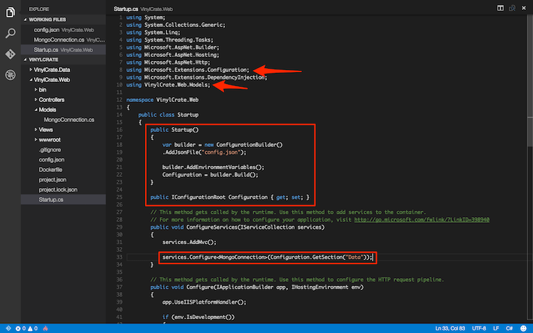
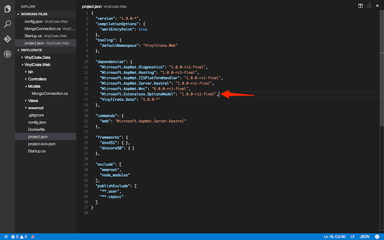

# Configure Database Connection

Now that we have a database, we can configure our application to connect to it and retrieve data.

The first thing we must do is configure our connection information, such as the server address, port, and database name. As mentioned earlier, ASP.NET Core has replaced XML config files with simple JSON files.

For config files, you can locate these wherever you prefer. You can also name them whatever you prefer. The default template creates an `appSettings.json` file for you in the project root. I personally prefer to create a `config.json` file in the root.

To begin this exercise, inside of `VinylCrate.Web`, create a JSON file in the project root. I recommend naming it `config.json` for consistency with this demo.



Within our `config.json`, let's add properties for our connection string:



Now, to populate these properties. The default server location for Mongo is `localhost:27017`. Our ServerAndPort value will be:

```
mongodb://localhost:27017
```

And if you recall in the previous exercise, our DatabaseName will be:

```
VinylCrate
```



To this point, we have our connection settings inside of our `config.json`, but how do we reference this in code?

First step is to create a model for our config. Inside of `VinylCrate.Web`, create a Models folder, and add a MongoConnection model.

```csharp
namespace VinylCrate.Web.Models
{
	public class MongoConnection
	{
		public string ServerAndPort { get; set; }
		public string DatabaseName { get; set; }
	}
}
```



Now that we have our model, we can use the built-in dependency injection from the framework within Startup to configure the serialization of our model.

Within `Startup.cs`, add the following using statements:

```
using Microsoft.Extensions.Configuration;
using VinylCrate.Web.Models;
```

Now, add a constructor:

```csharp
public Startup()
{

}
```

Now, let's create a new property, which will be our configuration object. There is a new interface available in ASP.NET Core, IConfigurationRoot.

```chsarp
public IConfigurationRoot Configuration { get; set; }
```

Inside of the constructor, we will set the value of this property using a ConfigurationBuilder. The ConfigurationBuilder allows you to specify any configuration file you may have, as well as environment variables.

The ConfigurationBuilder will take all of these files and merge them into one serialized object.

```csharp
public Startup()
{
	var builder = new ConfigurationBuilder()
	.AddJsonFile("config.json");
	
	builder.AddEnvironmentVariables();
	Configuration = builder.Build();
}
```

If you have multiple config files per each environment driven by an environment variable, you can pull in the HostingEnvironment to assist in deciding which file to use:

```csharp
public Startup(IHostingEnvironment env)
{
	var builder = new ConfigurationBuilder()
	.AddJsonFile("config.{env.EnvironmentName}.json");
	
	builder.AddEnvironmentVariables();
	Configuration = builder.Build();
}
```

To this point, we've established our configuration root, but we still have not applied any values to our MongoConnection object. The ConfigureServices method within the Startup is where all dependency injection occurs. This is where we will assign our MongoConnection model, and wire it up for use throughout our application.

Inside of Configure(), add the following line:

```csharp
services.Configure<MongoConnection>(Configuration.GetSection("Data"));
```

This line will use the ConfigurationRoot object (the value of the Configuration property) and retrieve the section from it called "Data", which it will then use to serialize into a MongoConnection object.



We can now use dependency injection within our Controllers and other classes to access the `MongoConnection` properties. In order to do, this, we will need to add a dependency on the ASP.NET `OptionsModel`.



Run `dnu restore`.

Open your `HomeController`.

Add the following usings:

```csharp
using Microsoft.Extensions.OptionsModel;
using VinylCrate.Web.Models;
```

Let's create a constructor for the controller, as well as a `MongoConnection` property:

```csharp
public MongoConnection DatabaseConnection { get; set; }

public HomeController()
{
	
}
```

Within the constructor is where we will wire up our dependency injection. By adding a parameter for the MongoConnection using the OptionsModel, we will get a reference to this each time we execute the `HomeController`.

```csharp
public HomeController(IOptions<MongoConnection> mongoConnection)
{
	DatabaseConnection = mongoConnection.Value;
}
```

With the MongoConnection wired up, let's test...

...but Visual Studio Code doesn't support debugging with breakpoints (yet).

Let's pause here until the next exercise.