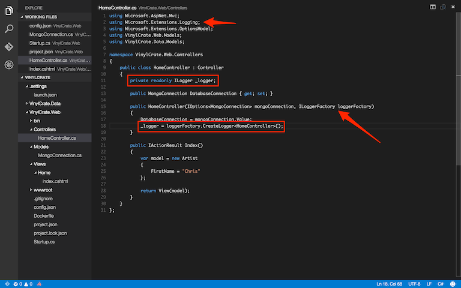

# Configure Logging within Vinyl Crate

This exercise discusses adding Logging to our application using the Microsoft Logging framework, new to ASP.NET Core. This framework can be, unsurprisingly, used for Logging; it can also assist with debugging during development.

Visual Studio Code does not currently support standard debugging, like you may be used to in Visual Studio proper. In terms of debugging ability, working with ASP.NET Core outside of Visual Studio proper is akin to working with Javascript. How do we debug Javascript? Console.log().

In order to begin using logging, we need to pull in the necessary dependencies. Open your `project.json` and add:

```
"Microsoft.Extensions.Logging": "1.0.0-rc1-final",
"Microsoft.Extensions.Logging.Console": "1.0.0-rc1-final",
"Microsoft.Extensions.Logging.Debug": "1.0.0-rc1-final",
```


There are a few configuration settings we have to add before we can wire up our logging through DI. Open the `config.json` and add:

```
"Logging": {
	"IncludeScopes": false,
	"LogLevel": {
		"Default": "Verbose",
		"System": "Information",
		"Microsoft": "Information"
	}
}
```

In the `Startup.cs` we will now configure logging. First, add a using for the Logging library:

```csharp
using Microsoft.Extensions.Logging;
```

Next, add a parameter to `Configure()` for the ILoggerFactory. This is another pieces of DI that we get "for free" via the framework.

```csharp
public void Configure(IApplicationBuilder app, IHostingEnvironment env, ILoggerFactory loggerFactory)
```

Within the body of `Configure()`, we can now add our method calls for the loggerFactory to establish Logging. We will read the "Logging" section of the `config.json` file to set our logging levels, and enable debug logging. Again, debug logging can be surrounded by a conditional checking the environment to ensure we do not have this enabled past development.

```csharp
loggerFactory.AddConsole(Configuration.GetSection("Logging"));
loggerFactory.AddDebug();
```

Now, if we go back to our HomeController, we can use DI to enable logging within the controller.

Add a parameter to the constructor for an `ILoggerFactory`:

```csharp
public HomeController(IOptions<MongoConnection> mongoConnection, ILoggerFactory loggerFactory)
```

Create a `private readonly` field for an ILogger that we will assign using the ILoggerFactory injected into our constructor:

```csharp
private readonly ILogger _logger;
```

Within the constructor, create a logger instance from the `LoggerFactory`:

```csharp
_logger = loggerFactory.CreateLogger<HomeController>();
```



Now that we have our logger, we can use this to record the values of our variables at the time of execution. Inside of our constructor, let's log the current values of the MongoConnection ServerAndPort and DatabaseName.

Add the following two lines:

```csharp
_logger.LogInformation($"Server And Port: {DatabaseConnection.ServerAndPort}");
_logger.LogInformation($"Database Name: {DatabaseConnection.DatabaseName}");
```


Sidebar: The above lines of code use a C# 6.0 feature called string interpolation. This is a replacement for `string.Format()` and allows for inline use of variable values, removing the need for placeholders. String interpolation can be used by specififying `$` before the string.

Lets restore and run...

```
dnu restore
dnu build
```

With logging enabled, when we run `dnx web` we will see more "noise" in our Command/Terminal window. We should also be able to see the two log messages we added regarding the MongoConnection values.


