# Create ArtistService in VinylCrate.Data and Retrieve Database Records

With our database connection configured, we can now create a repository inside of our Data layer to retrieve our Artist records for us. The repository pattern is a common design pattern used in data retrieval in order to keep separation of concerns between the database and your business logic. You can read more on it [here](https://msdn.microsoft.com/en-us/library/ff649690.aspx).

Create a `Repositories` folder inside of `VinylCrate.Data`. Within this folder, let's create the repository class for Artists.

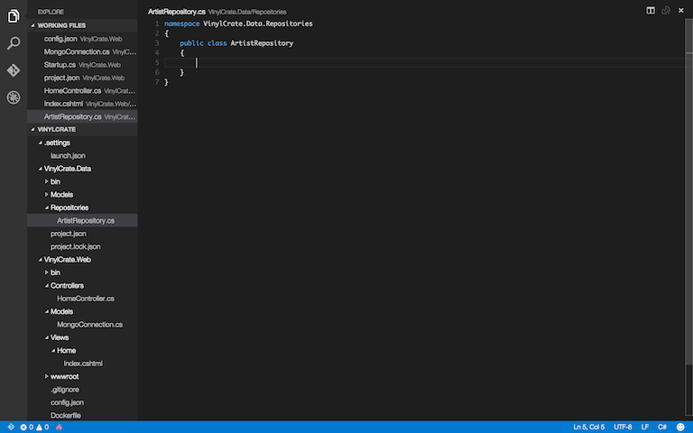

In many instances, most of us are used to using ORM's to connect to databases. For this exercise we are going to be using the [MongoDB Driver for C#](https://docs.mongodb.org/ecosystem/drivers/csharp/), which is essentially a lightweight ORM. As if with any other library, we will be referencing this via NuGet. Let's add the dependency within the `project.json` file of `VinylCrate.Data`.

Looking at the `project.json` for this project, it appears slightly different than the one in `VinylCrate.Web`.

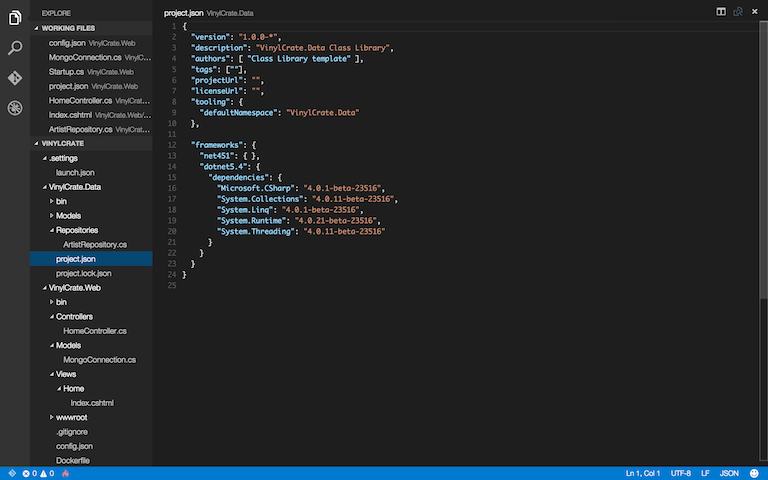

Looking at the "frameworks" section, we see that we are targeting both .NET 4.5.1 and .NET 5.4 (or .NET Core). Within the designation for "dotnet5.4" we see a "dependencies" node. You can specify framework specific dependencies. This is helpful in the instance of having a library that may be compatible with one framework version but not the other. By default, Yeoman is giving us beta builds of standard libraries we would find in .NET 4.5.1 for .NET Core.

In order to add our dependency on the MongoDB Driver, we will be creating a "dependencies" node at the root of the `project.json`, which allows these dependencies to be used across all target framerowks (similar to how dependencies are configured in the `VinylCrate.Web` prpoject).

```
"dependencies": {
    "MongoDB.Driver": "2.2.3"
  },
```

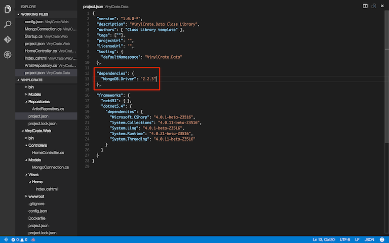

Now that we have added the dependency, we need to run `dnu restore`.

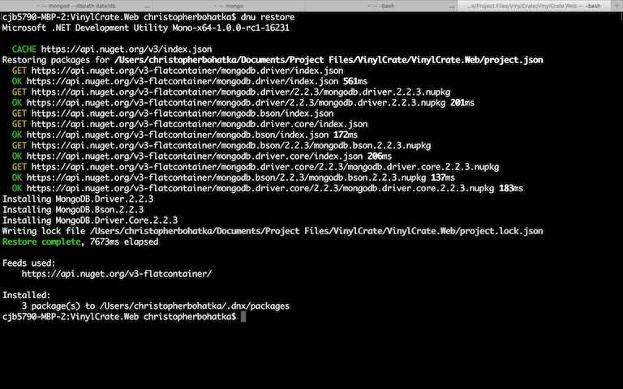

Now, to verify our changes so far, let's build:

```
dnu build
```

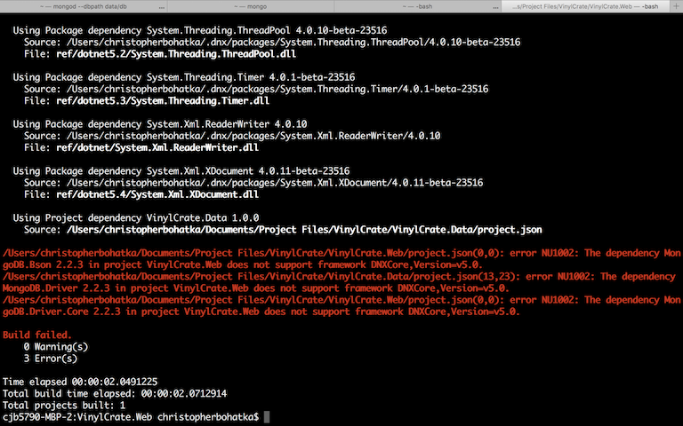

We are presented with a handful of failures on build. If we examine the errors, we will see that the MongoDB Driver we just added is not compatible with DNXCore.

In order to resolve this, we have a few options...

a) Find and use a .NET Core supported library
b) Use separate libraries for .NET 4.5 and .NET Core
c) Remove our dependency on .NET Core

If we were to use option b, we would essentially be forced to put IF/DEF's throughout our code to use the correct libraries based on the target framework. While this option does improve compatibility, the ASP.NET team has admitted this is not a great solution.

For the purposes of our exercises, we are not using anything .NET Core specific, so let's remove our dependency on it.

Remove the following block from the `VinylCrate.Data` `project.json` file:

```
"dotnet5.4": {
	"dependencies": {
		"Microsoft.CSharp": "4.0.1-beta-23516",
		"System.Collections": "4.0.11-beta-23516",
		"System.Linq": "4.0.1-beta-23516",
		"System.Runtime": "4.0.21-beta-23516",
		"System.Threading": "4.0.11-beta-23516"
	}
}
```

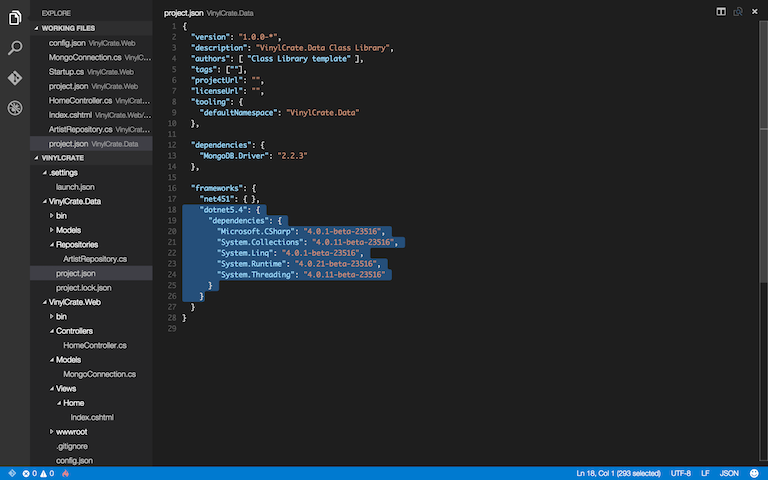

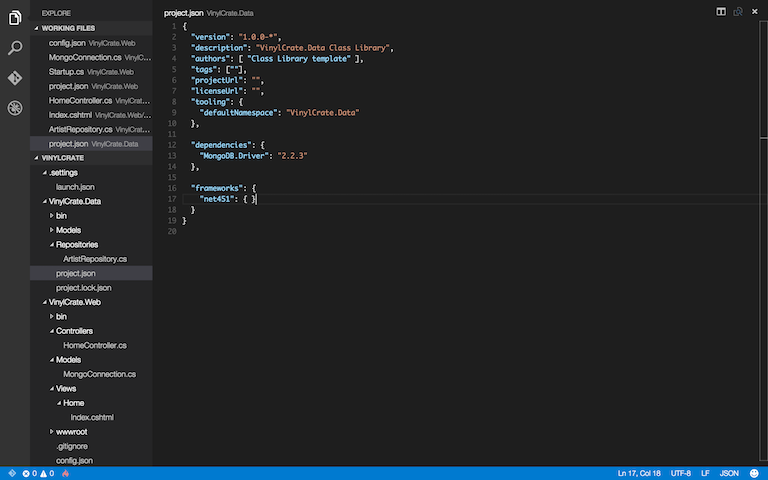

And remove the following block from the `VinylCrate.Web` `project.json` file:

```
"dnxcore50": {}
```

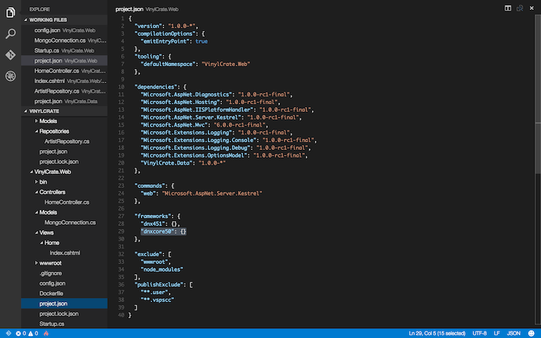

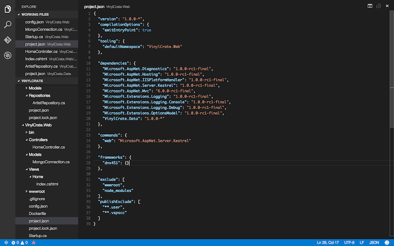

Now, we will need to perform a new restore. The `dnu restore` command will look at the target frameworks and pull down package versions for each target. Now that we have modified our targets, we must restore again.

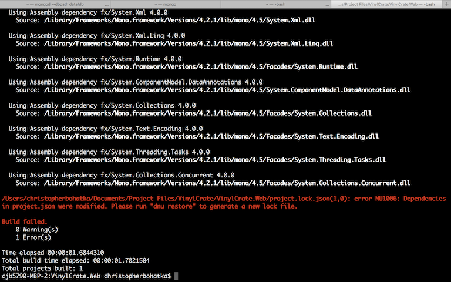

If we build after restore, we should have a green build once again.


Alright. Now we have our MongoDB Driver and we've resolved our build compatibility issues. Back to creating our ArtistRepository.

First, we have to make a small adjustment to our model. MongoDB, like ~~all~~ most databases, has an Id field. This field is auto-generated on record submission. Now that we are going to be retrieving records from the database, the MongoDB Driver handles the mapping and serialization for us. In order for this to occur without error, we must add the identifier field to our model. MongoDB is very strict when it comes to serialization. By default, if all fields aren't present on the class you are serializing into, there will be an error. There are overrides for this, but given that we are working with a single Id field, we are going to just add this to our model. The Id field within Mongo can be referenced by two names: _id or ObjectId. I normally opt for _id due to the fact that the field type is also ObjectId; this keeps a distinct difference between type and name.

Inside of our `Artist.cs` class, add a using for the MongoDB Driver:

```csharp
using MongoDB.Bson;
```

Now, add the _id field:

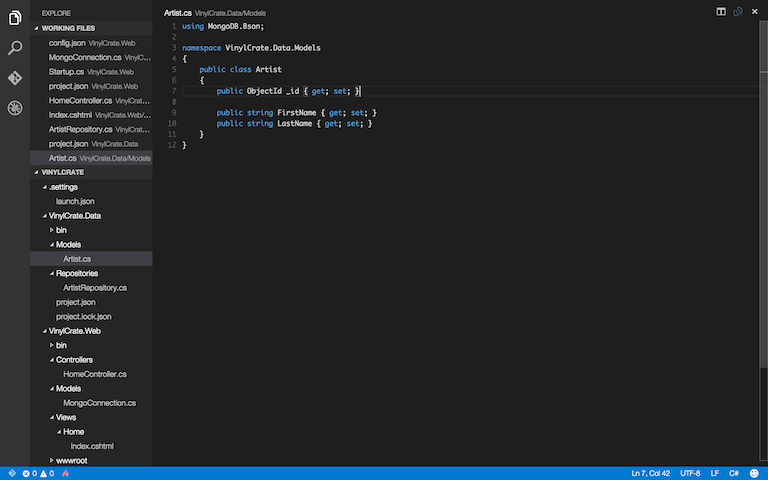

Moving (back) onto our ArtistRepository, let's configure our dependencies using dependency injection via constructor injection. We will need to do a small refactor, given that our Artist model has FirstName and LastName, but our Mongo Collection only has a singular name field. 

Let's replace FirstName and LastName within `Artist` with:

```csharp
public string Name { get; set; }
```

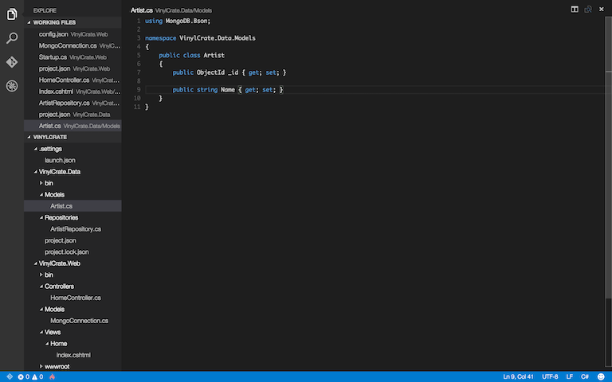

Now, remove the model references from our Home/Index (Controller and View, both).

With that refactor complete, and a green build, let's (finally) get to building our ArtistRepository.

Create a constructor and inject the ServerAndPort and the DatabaseName:

```csharp
public ArtistRepository(string serverAndPort, string databaseName)
{
	
}
```

Now, we need to create a database connection using these values. Let's create a `Connect()` function that will accept these values. This function will return an instance of IMongoCollection, of Artist type.

```csharp
private IMongoCollection<Artist> Connect(string serverAndPort, string databaseName)
{
	
}
```

In order to create our connection and get reference to our collection, we need to use the `MongoClient`. We first create a `MongoClient` using the server and port (re: connectionString).

```csharp
var client = new MongoClient(serverAndPort);
```

Which we then use to get the database we are working with:

```csharp
var database = client.GetDatabase(databaseName);
```

Using this database reference, we can access a specific collection by name:

```csharp
return database.GetCollection<Artist>("Artists");
```

Resulting in:

```csharp
private IMongoCollection<Artist> Connect(string serverAndPort, string databaseName)
{
	var client = new MongoClient(serverAndPort);
	var database = client.GetDatabase(databaseName);
	
	return database.GetCollection<Artist>("Artists");
}
```

Now, within our constructor, we can call Connect, and set the value to an instance field for use throughout the repository.

```csharp
private readonly IMongoCollection<Artist> _database;

public ArtistRepository(string serverAndPort, string databaseName)
{
	_database = Connect(serverAndPort, databaseName);
}
```

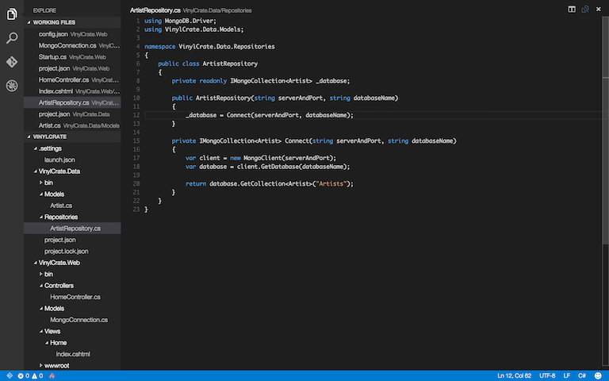

Build to make sure we didn't cause any errors.

```
dnu build
```

Did you remember your usings?

```
using MongoDB.Driver;
using VinylCrate.Data.Models;
```

With our repository configured, we can now write a method to retrieve all available records. This method will return a list of Artists. We need to add a using for .NET Collections (the most forgotten one):

```
using System.Collections.Generic;
```

Now, write out the method signature for `GetAll()`:

```csharp
public List<Artist> GetAll()
```

There are no parameters because we want it to retrieve all records. All this method needs to do is reach out to the database and grab everything.

The MongoDB Driver `Find()` function requires an empty Bson Document, similar to how we had to pass in an empty JSON object inside of the Command/Terminal Mongo Client.

In order to accomplish this without newing up an object and creating useless pointers, we will use fluent syntax to satisfy the argument of `Find()`:

```csharp
public List<Artist> GetAll()
{
	return _database.Find(_ => true).ToList();
}
```

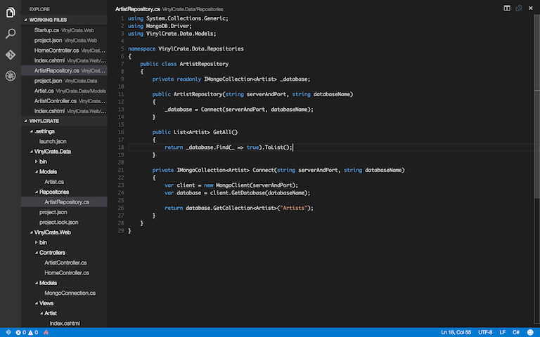

We can now retrieve Artist records from the database using our repository. Unfortunately, we cannot test this until we move into the Web layer and build our calls into the repository. Let's do that next...

...in Exercise #10.